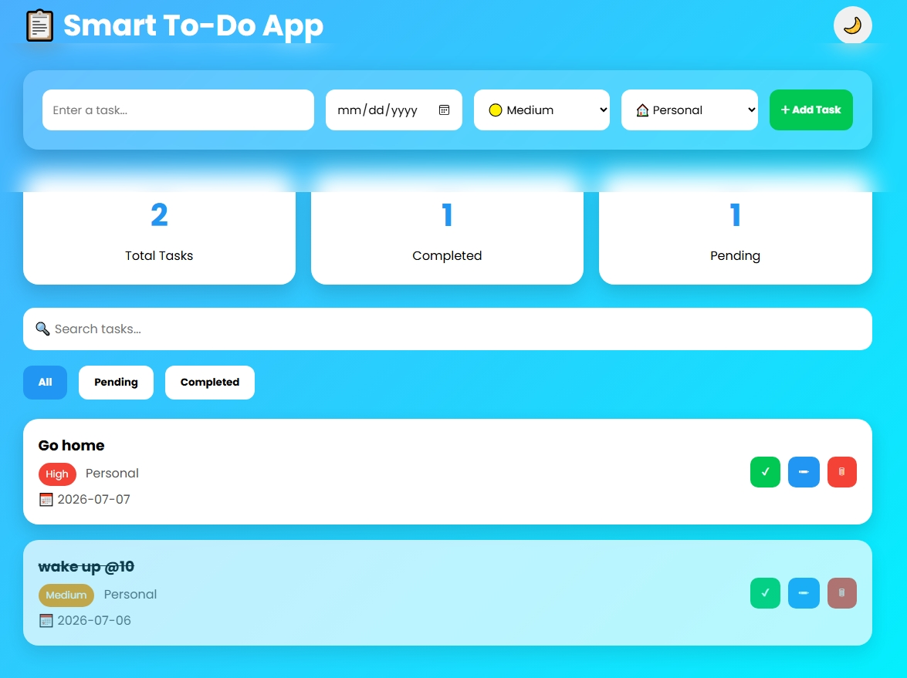

# 📋 Smart To-Do App

A modern and responsive To-Do Web Application built using **HTML, CSS, and JavaScript**.

This application helps users manage their daily tasks by allowing them to add, edit, delete, search, and organize tasks with priorities and due dates.

Developed as part of the **Oasis Infobyte Web Development & Design Internship (Level 2 – Task 3).**

---

## 📸 Preview

> Add a screenshot after uploading the project to GitHub.



---

## ✨ Features

- Add new tasks
- Edit existing tasks
- Delete tasks
- Mark tasks as completed
- Search tasks
- Filter:
  - All
  - Pending
  - Completed
- Dashboard Statistics
- Priority Levels
- Categories
- Due Dates
- Dark Mode
- Local Storage
- Responsive Design

---

## 🛠 Technologies Used

- HTML5
- CSS3
- JavaScript (ES6)
- Local Storage API

---

## 📂 Folder Structure

```
Smart-ToDo-App/
│
├── index.html
├── style.css
├── script.js
├── README.md
└── images/
      └── screenshot.png
```

---

## 🚀 Getting Started

1. Download or clone the repository.

2. Open the project folder.

3. Open:

```
index.html
```

or use Live Server in Visual Studio Code.

---

## 📈 Dashboard

The application displays:

- Total Tasks
- Completed Tasks
- Pending Tasks

These update automatically whenever tasks are added or completed.

---

## 💾 Data Storage

Tasks are saved using the browser's **Local Storage**, so they remain available even after refreshing the page.

---

## 🔮 Future Improvements

- Drag and Drop Tasks
- Due Date Notifications
- Task Sorting
- Calendar View
- User Authentication
- Cloud Database Integration
- Export Tasks to PDF

---

## 👨‍💻 Author

**Nkosinathi Msimango**

Created for the Oasis Infobyte Web Development Internship.

---

## 📄 License

This project is intended for educational and portfolio purposes.